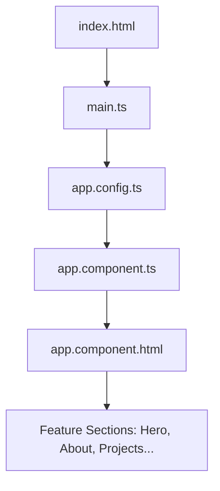

# 🎓 Learning Angular: A Hands-on Guide (Through Your Portfolio Project)

Welcome to your Angular learning journey! This note breaks down the basics of Angular using your portfolio project as a living classroom. By the end of this guide, you will understand how Angular operates, how your codebase is structured, and how the "magic" happens.

---

## 🏗️ 1. What is Angular? (The Big Picture)

At its core, Angular is a **Component-Based Framework** for building Single-Page Applications (SPAs).

*   **Single-Page Application (SPA)**: Traditional websites load a brand new HTML page from the server every time you click a link. In Angular, the browser loads **only one** HTML file (`index.html`). When you navigate, Angular dynamically swaps elements on the screen without reloading the browser. This is why the app feels incredibly fast and smooth.
*   **Component-Driven**: Everything you see on the screen is a "Component" (a Lego brick). A component is a self-contained unit of UI. For example, your navigation bar is a component, your about section is a component, and a single project card is a component.

---

## 🧩 2. The Anatomy of an Angular Component

Every component in Angular is made of three core parts, which you can see in any of your folders (like `src/app/shared/components/navbar/`):

1.  **The Logic (`.ts` file)**: Written in TypeScript (a strongly-typed version of JavaScript). This is where you define the data, API calls, and behavior (like click actions).
2.  **The Template (`.html` file)**: Determines the structure of the HTML.
3.  **The Style (`.css` file)**: Formats how this specific component looks. Crucially, in Angular, component styles are **scoped** by default—meaning CSS rules in your navbar CSS file *cannot* accidentally break the styling in your contact CSS file!

Let's look at a snippet from your [navbar.component.ts](file:///Users/adityamore/IdeaProjects/my-portfolio/src/app/shared/components/navbar/navbar.component.ts):

```typescript
@Component({
  selector: 'app-navbar',        // 1. The custom HTML tag we use to place this component: <app-navbar></app-navbar>
  standalone: true,              // 2. Modern Angular: It imports its own dependencies (no central module needed)
  imports: [],                   // 3. Lists other components/directives this component needs to use
  templateUrl: './navbar.component.html', // 4. Links to the HTML template
  styleUrls: ['./navbar.component.css']   // 5. Links to the stylesheet
})
export class NavbarComponent {
  isMobileMenuOpen = signal(false); // Reactive state (a Signal)
  
  toggleMobileMenu() {
    this.isMobileMenuOpen.update(v => !v); // Changes the state
  }
}
```

---

## ⚡ 3. Core Angular Concepts (The Magic Mechanics)

Angular uses special syntax in the HTML templates to connect your TypeScript logic to what the user sees.

### A. Data Binding
Data binding is how TypeScript variables talk to the HTML template. There are 4 types:

1.  **Interpolation (`{{ value }}`)**: Outputs TypeScript data as text in the HTML.
    ```html
    <h3>{{ project.title }}</h3>
    ```
2.  **Property Binding (`[property]="value"`)**: Binds a TypeScript variable to an HTML property.
    ```html
    <a [href]="project.liveUrl">Live Link</a>
    ```
3.  **Event Binding (`(event)="action()"`)**: Listens for user interactions (clicks, keyboard input) and triggers a TypeScript method.
    ```html
    <button (click)="toggleMobileMenu()">Toggle</button>
    ```
4.  **Attribute Binding (`[attr.name]="value"`)**: Binds a value to standard HTML attributes when a component property does not exist (like accessibility tags).
    ```html
    <a [attr.aria-label]="'View ' + project.title">
    ```

---

### B. Modern Angular Control Flow (V17+)
Angular templates let you write logic directly inside your HTML using the `@` syntax.

#### 1. Conditional Rendering (`@if` / `@else`)
Displays elements only if a condition is met.
```html
@if (project.liveUrl) {
  <a [href]="project.liveUrl">Live Demo</a>
} @else {
  <span>Private Project</span>
}
```

#### 2. Loop rendering (`@for`)
Loops through an array of data and prints HTML for each item.
```html
@for (tag of project.tech; track tag) {
  <span class="tech-tag">{{ tag }}</span>
}
```
*Note: The `track tag` statement is mandatory. It helps Angular dynamically update the DOM efficiently when list items change.*

---

### C. Signals: The New Reactivity Engine (V16+)
A **Signal** is a special wrapper around a value that notifies Angular whenever that value changes. 

In your [navbar.component.ts](file:///Users/adityamore/IdeaProjects/my-portfolio/src/app/shared/components/navbar/navbar.component.ts), we declared:
```typescript
isScrolled = signal(false); // Initializes the signal with 'false'
```

*   **Reading a Signal**: In your HTML, you call it like a function: `isScrolled()`
    ```html
    <nav [class.scrolled]="isScrolled()">
    ```
*   **Writing to a Signal**: In your TypeScript, you change it using `.set()` or `.update()`:
    ```typescript
    this.isScrolled.set(true);
    ```
Whenever `isScrolled` changes, Angular *only* updates the specific HTML elements that read `isScrolled()`. It does not redraw the entire page!

---

## 🗺️ 4. How the Application Starts (Bootstrapping Flow)

Here is the exact chain of events when someone visits your website:



1.  **`index.html`**: The single HTML page. It has a placeholder tag: `<app-root></app-root>`.
2.  **`main.ts`**: The entry point for execution. It bootstraps (starts) your `AppComponent`.
3.  **`app.config.ts`**: Sets up global providers (like Router or Animations).
4.  **`app.component.ts`**: The parent controller.
5.  **`app.component.html`**: The structure template of the parent. Inside it, you'll find the navbar, footer, and individual section selector tags:
    ```html
    <app-navbar></app-navbar>
    <main>
      <app-hero></app-hero>
      <app-about></app-about>
      <app-projects></app-projects>
      <app-contact></app-contact>
    </main>
    <app-footer></app-footer>
    ```

---

## 🎓 5. Your Next Exercise (Learning by Doing)

To cement these basics, let's make a small improvement to your portfolio.

### The Mission: Add a "Quick Contact" Counter
We will add a button in your `About` component that says "Send a Quick Hello 👋". When clicked, it will increment a counter signal and show a small alert, helping you practice:
1. Creating a Signal state.
2. Property Binding.
3. Event Binding.
4. Conditional flow.

Let me know if you are ready to start writing this code!
